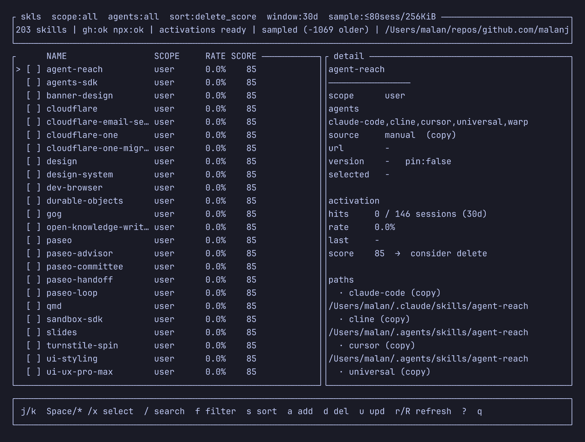

# skls

[English](README.md) | [日本語](README.ja.md)

[](https://crates.io/crates/skls)
[](https://docs.rs/skls)
[](LICENSE)
[](https://github.com/malanjp/skls/releases)

**skls**（*skills list*）— Cursor / Claude Code / Codex ほか 20+ ホストのエージェントスキルを横断管理する TUI。

どのスキルが入っているか、どこに効いているか、使われているかを一覧で把握し、追加・削除・更新まで同じ画面で行う。



## できること

- **一覧**: 27 エージェントホスト（Cursor が読む `~/.agents/skills` も含む）。Claude Code / Cursor / Codex / agents プラグインに同梱されたスキルもスキャン。project / user とエージェントでフィルタ、複数選択で一括操作
- **サイドバー**: 左ナビで **manual**（プラグイン同梱スキルも含む）/ **gh** / **npx** / **plugins** / **mcp** に分割。`h`/`l`（または Tab）でフォーカス、サイドバー上の `j`/`k` でカテゴリ切替、`t` でも循環
- **指標**: 会話ログから発動率を算出し、削除判断スコア（`delete_score`）を表示する
- **追加**: スキルは `gh skill` / `npx skills`。プラグインは `claude plugin` / `copilot plugin` / `codex plugin`（Cursor にカタログ CLI は無い）
- **削除**: インベントリ上のパスを削除（確認必須）。npx 由来は `npx skills remove` も実行。プラグイン削除はホストのカタログ CLI を先に使う。共有ストア / プラグイン内パスは警告
- **更新**: スキルは `gh skill` / `npx skills`。プラグインは同じカタログ CLI（Codex は `plugin add` の再実行）

## 依存

| 必須 | 任意 |
|------|------|
| Rust 1.85+（edition 2024） | [`gh`](https://cli.github.com/)（`gh skill`） |
| | Node.js / `npx`（[`npx skills`](https://skills.sh/)） |
| | `claude` / `copilot` / `codex`（プラグインカタログの追加・更新・削除） |

`gh` / `npx` / プラグイン CLI がなくても一覧と発動率は動く。足りない CLI に依存する操作だけ無効になる。

## インストール / 起動

[crates.io](https://crates.io/crates/skls) から:

```bash
cargo install skls
skls
```

ソースから:

```bash
git clone https://github.com/malanjp/skls.git
cd skls
cargo install --path .
# または: cargo run --release
```

### CLI オプション

```bash
skls                                 # cwd を project root として起動
skls --project-root /path/to/repo
skls --window-days 30                # 発動率の集計窓（日）
skls --max-sessions 200              # エージェントあたり読むセッション数（既定 80）
skls --max-bytes 1048576             # セッションファイルあたりの読込上限バイト（既定 256KiB）
skls --full-scan                     # セッション / バイト上限なし（大きいログツリーでは遅い）
skls --dump-json                     # TUI なしで JSON 出力（{ skills, plugins, mcp_servers }）
```

起動時はスキル一覧を先に出し、その後に発動率をサンプリング解析する。既定上限なら通常 1〜2 秒程度で一覧まで到達する。

### プロジェクトディレクトリ

`skls` は、現在のディレクトリ（または `--project-root`）に加えて、`~/.config/skls/config.toml`（`$XDG_CONFIG_HOME` が設定されている場合は `$XDG_CONFIG_HOME/skls/config.toml`）に列挙した追加フォルダを、プロジェクトスコープのスキャン対象として扱います。

```toml
projects = [
  "~/src/my-app",
  "/abs/path/to/other-app",
]
```

現在のディレクトリ（または `--project-root`）がホームディレクトリの場合、そのパス自体はプロジェクトとしてスキャンしません。設定に列挙したパスは引き続きスキャンします。異なるプロジェクトに同名のスキルがある場合は別行として表示します。一覧の `PROJECT` 列にはプロジェクトディレクトリの名前が入り、ユーザースコープの行は `-` になります。

プロジェクトスコープでの追加は、引き続きアクティブなルート（カレントディレクトリ / `--project-root`）だけを対象にします。ルートがホームの場合は、ユーザースコープを選ぶか `--project-root` を指定してください。

## 画面

左サイドバーでインベントリを分割する: **manual**（プラグイン同梱スキルも含む）· **gh** · **npx** · **plugins** · **mcp**。中央が一覧、右が詳細。`h`/`l`（または Tab）でサイドバーと一覧のフォーカスを切替。行頭の `[ ]` / `[x]` は複数選択。

**スキル**の列は `NAME` · `SCOPE` · `PROJECT` · `SRC`（`plugin` / `gh skill` / `npx skills` / `manual`）· `AUTHOR` · `RATE` · `SCORE`。デフォルトソートは `delete_score` の降順（高いほど削除候補）。`S` で昇順/降順を切替。`s` でキーを変えるとそのキーの既定方向に戻る。作者は SKILL.md の frontmatter・プラグインマニフェスト・ソースリポジトリの GitHub owner から取得する。

**プラグイン**の列は `NAME` · `SCOPE` · `MARKET` · `SK`（同梱スキル数）· `MCP`。

**MCP**の列は `NAME` · `TRANS`（`stdio` / `http` / `sse`）· `PLUGIN` · `AGENTS`。プラグインの `mcp.json` / `.mcp.json` を読む（Agent Plugins 1.0、および `command` / `url` だけの緩め形式）。

タイトルの `sample:` は発動率解析の上限、ステータスの `sampled (-N older)` はスキップした古いセッション数を示す。

## キーバインド

| キー | 動作 |
|------|------|
| `h` / `l` | サイドバー / 一覧にフォーカス（`Tab` で切替） |
| `j` / `k` | 移動（サイドバーまたは一覧） |
| `Ctrl+F` / `PgDn` | 次ページ（端で止まる。一覧） |
| `Ctrl+B` / `PgUp` | 前ページ（端で止まる。一覧） |
| `gg` / `Home` | 先頭行（一覧）/ 先頭ナビ（サイドバー） |
| `L` / `Ctrl+L` / `End` | 末尾行（一覧）/ 末尾ナビ（サイドバー） |
| `t` | サイドバー循環（manual → gh → npx → plugins → mcp） |
| `Space` | 行の選択トグル |
| `*` | 表示中を全選択 / 全解除 |
| `x` | 選択クリア |
| `/` | 名前・説明の検索 |
| `f` | フィルタパネル |
| `s` | ソートキー切替（`name` → `rate` → `delete_score` → `last_hit` → `author` → `source`）。そのキーの既定方向に戻す |
| `S` | ソート方向の切替（昇順 / 降順） |
| `a` | 追加フロー（manual: `gh`/`npx` 選択、gh/npx ナビ: その backend、plugins: カタログ CLI） |
| `d` | 削除確認（選択があれば一括、なければカーソル行） |
| `u` | 更新 |
| `r` | 軽い再スキャン（一覧のみ） |
| `R` | 発動率を再計算 |
| `?` | ヘルプ |
| `q` | 終了 |

### フィルタ（`f`）

| キー | 内容 |
|------|------|
| `p` / `u` / `a` | project / user / 全スコープ |
| `j` / `k` · `Space` | エージェントフィルタの移動 / トグル（空 = 全エージェント） |
| `*` / `0` | エージェントフィルタ解除（全エージェント） |
| `x` | エージェントフィルタ解除 |
| `c` | 全フィルタクリア |

### 追加（`a`）

**manual** ナビではダイアログで順に進む。`Esc` で前のステップ、`q` で中止。

1. backend 選択: `1`/`g` = `gh skill`、`2`/`n` = `npx skills`
2. ソース入力（gh: 検索語、npx: `owner/repo` または `owner/repo@skill`）
3. 結果選択（gh の場合）
4. エージェント（`j`/`k` で移動、`Space` でトグル、`*` 全選択、`x` 全解除。`Enter` で次へ）→ スコープ（`p`/`u`）で実行

**gh** / **npx** ナビでは backend 選択を飛ばし、そのインストーラを直接使う。

**plugins** ナビではカタログ spec（`name@marketplace`）を入力し、プラグイン CLI があるホスト（`claude-code` / `copilot` / `codex`）を選んでからスコープを決める。Cursor にカタログ CLI は無いので、ホストの marketplace から入れる。

**mcp** ナビの `a` / `u` は plugins サイドバーへ誘導する（サーバーはプラグインに同梱される）。

### 削除（`d`）

- 開始時は対象スキルが持つエージェントがすべて選択される
- `j`/`k` で移動、`Space` でトグル、`*` 全選択、`x` 全解除
- `y` / `Enter` で実行、`n` / `q` / `Esc` でキャンセル
- インベントリのパスを先に削除し、`source: npx` なら選択エージェントごとに `npx skills remove` も実行する
- 共有ストア（例: `~/.agents/skills`）やプラグイン内のパスは警告。複数ホストで同じパスは重複排除する
- 削除後は一覧だけ再スキャンする。発動率は `R` で再計算する

プラグイン削除（プラグインビュー、または MCP ビューから親プラグイン）はホストのカタログ CLI を先に実行する:

| ホスト | CLI |
|--------|-----|
| Claude Code | `claude plugin uninstall SPEC --scope user\|project` |
| Copilot | `copilot plugin uninstall NAME` |
| Codex | `codex plugin remove NAME` |
| Cursor | CLI なし — メッセージのみ。パスはそのまま |

CLI がすべて失敗したときだけ、インベントリのパスをフォールバックで消す。

### 更新（`u`）

**スキル**

1. エージェント選択: `j`/`k` で移動、`Space` でトグル、`*` 全選択、`x` 全解除。`Enter` で次へ
2. backend 選択: `1`/`g` = `gh skill`、`2`/`n` = `npx skills`（`Esc` でエージェント選択に戻る）
3. 推定があるときは `Enter` でその backend を採用できる
4. 片方の CLI しか無い場合は backend 選択を省略する

推定の優先順位:

| 判定 | 推定 |
|------|------|
| `SKILL.md` に `github-repo` / `github-tree-sha` がある、または `gh skill list` の provenance | `gh skill` |
| `~/.agents/.skill-lock.json`（または project 側の lock）に載っている | `npx skills` |
| 両方ある場合 | `gh skill` を優先 |
| 混在・不明 | 推定なし（手動選択） |

`gh skill update` は、メタデータのあるホストディレクトリ（`.cursor` / `.codex` など）を優先して `--dir` する。`npx skills update` はスコープに応じて `-g` / `-p` を付ける。

**プラグイン**はエージェントを選んだあと、次を実行する:

| ホスト | CLI |
|--------|-----|
| Claude Code | `claude plugin update SPEC --scope …` |
| Copilot | `copilot plugin update NAME` |
| Codex | `codex plugin add SPEC`（再インストール） |

## スキャン対象

| Agent | project | user |
|-------|---------|------|
| cursor | `.agents/skills/` · `.cursor/skills/` | `~/.cursor/skills/` · `~/.agents/skills/` · `~/.cursor/skills-cursor/` |
| claude-code | `.claude/skills/` | `~/.claude/skills/` |
| codex | `.agents/skills/` · `.codex/skills/` | `~/.codex/skills/` |
| gemini-cli | — | `~/.gemini/skills/` |
| antigravity / antigravity-cli / antigravity2.0 | — | `~/.gemini/antigravity{,-cli}/skills/` · `~/.gemini/config/skills/` |
| github-copilot | — | `~/.copilot/skills/` |
| opencode | — | `~/.config/opencode/skills/` |
| pi | — | `~/.pi/agent/skills/` |
| amp / kimi-cli / replit | — | `~/.config/agents/skills/` |
| qwen-code | — | `~/.qwen/skills/` |
| augment / continue / droid / kilo / qoder / roo / trae / codebuddy | — | `~/.<host>/skills/`（droid は `~/.factory/skills/`） |
| grok / warp / devin | — | `~/.grok/skills/` · `~/.warp/skills/` · `~/.config/devin/skills/` |
| cline / warp / universal | — | 共有 `~/.agents/skills/` にも紐づけ |

同一スキルが複数ホストにある場合は 1 行に集約する。追加フローの初期選択は cursor / claude-code / codex（`*` で全ホスト）。

追加のメタデータ:

- `gh skill list --json` があれば `source_url` / `version` / `pinned` を付与する
- `~/.agents/.skill-lock.json` があれば `source: npx` を付与する（`npx skills list` は起動時に呼ばない）

スコープ語彙は `gh skill` 準拠（`project` / `user`）。`npx skills -g` は user と同一視する。

### プラグイン

エージェントプラグインに同梱されたスキルは、ファイルの実体があるホストに紐付ける:

| ストア | パス | 紐付けホスト |
|-------|------|-------------|
| Claude Code | `~/.claude/plugins/`（`installed_plugins.json` を参照、scope はマニフェスト由来） | claude-code |
| Cursor | `~/.cursor/plugins/cache/*/*/*/skills/` | cursor |
| Codex | `~/.codex/plugins/cache/*/*/*/skills/` | codex |
| agents | `~/.agents/plugins/`（`skills/` ディレクトリを lenient に探索） | 共有ストアのホスト（cursor / cline / warp / universal） |

プラグイン由来のスキルは `source: plugin` として扱う。`gh` / `npx` では更新せず、プラグイン内のスキルパスを消すときは警告する。

パッケージ自体の追加・更新・削除は **plugins** ビュー（`t`）からカタログ CLI で行う。同梱 MCP（`mcp.json` / `.mcp.json`）は **mcp** ビューに出る。

## 発動率と削除スコア

直近 N 日（デフォルト 30）のセッションログを解析し、スキル名またはパス言及を **セッション単位でユニークカウント** する。

| ソース | パス |
|--------|------|
| Cursor | `~/.cursor/projects/**/agent-transcripts/**/*.jsonl` |
| Claude Code | `~/.claude/projects/**/*.jsonl` |
| Codex | `~/.codex/sessions/**/rollout-*.jsonl` |

- `activation_rate` = `hits / sessions_total`（セッション 0 のときは N/A）
- `delete_score` が高いほど削除候補（下記の加点の合計）
- 詳細のラベル: `keep`（35 未満） / `review`（35–59） / `consider delete`（60 以上）

`delete_score` の加点（実装: `src/analytics/score.rs`）:

| 要因 | 条件 | 加点 |
|------|------|------|
| 発動率 | セッションなし / 不明 | +25 |
| | 0% | +40 |
| | 5% 未満 | +30 |
| | 15% 未満 | +15 |
| | 30% 未満 | +5 |
| 最終ヒット | なし | +20 |
| | 60 日超 | +25 |
| | 30 日超 | +15 |
| | 14 日超 | +8 |
| ホスト数 | 3 エージェント以上 | +10 |
| | 2 エージェント | +5 |
| provenance | `manual` かつ `source_url` なし | +5 |
| ヒット | `hits == 0` | +10 |

ログ照合はヒューリスティックであり、厳密な「スキル実行回数」ではない。削除前の判断材料として使う。

速度のため、既定ではエージェントあたり **直近 80 セッション**、ファイルあたり **最大 256KiB** だけ読む。上限は `--max-sessions` / `--max-bytes` / `--full-scan` で変えられる。

## 開発

構成・注意点は [AGENTS.md](AGENTS.md) を参照。

```bash
cargo test --lib
cargo run --release -- --dump-json
```

## Changelog

[CHANGELOG.md](CHANGELOG.md)（[日本語](CHANGELOG.ja.md)）を参照。

## ライセンス

[MIT](LICENSE)
